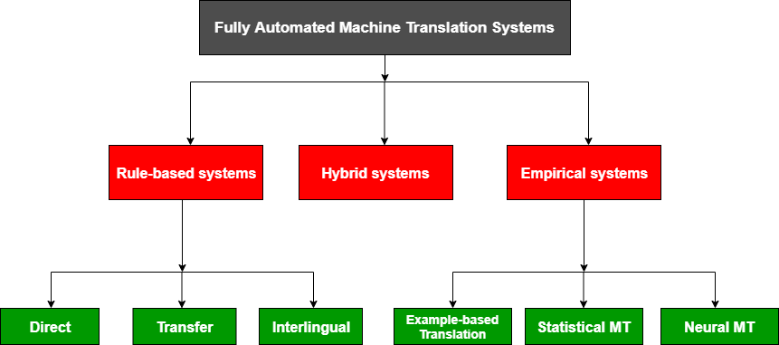

# Natural Language Processing (NLP) - Notes

## Overview

NLP is a computer science, artificial Intelligence subsets which deals with Human Language.

## Application

* Sentimental Analysis: (ex: fb emojis)
* Chatbot (costumer assistance)
* Speech Recognition (voice assistance, like windows cortana)
* Machine Translation (google translate)
* Spell Checking
* Information Extraction
* Keyword Searching
* Advertisement 

## Components of NLP

Natural Language Understanding (NLU)
- Mapping input to useful representations
- Analyzing different aspects of the language
- Ambiguity lexical
- Ambiguitysyntactic 
- Ambiguity referential
 
Natural Language Generation (NLG)
- Text planning
- Sentence planning
- Text realization

TEXT MINING: analysation of information from natural language text.

## NLP Pipeline

Src: [Basic Steps In Natural Language Processing Pipeline](https://monicamundada5.medium.com/basic-steps-in-natural-language-processing-pipeline-763cd299dd99)

## NLP Techniques

1. **SYNTACTIC ANALYSIS** : understanding the grammar of the text
   - **Segmentation** : split document into contituent units (one or more sentences)
   - **Tokenization** : split a phrase into a small part od token
   - **Stemming** : normalize words into its base form or root form
   - **Lemmatization**: morphological analyse of the phrase (based on dictionary : meaning and synonym)
   - **POS tagging** : classify a part of the speech : verb, adj, noun 
   - **Named Entity Recognition (NER)**: classify a group of word in a group : movie, monetary value, organizatio, location, quantities, person
   - **Chunking**: picking individual pieces of informations and grouping them into bigger Pieces
   - **Parsing(tree)**: grammatical analysis of the sentence

2. **SEMANTIC ANALYSIS** : understanding the literal meaning of the text.
   - Text Correction
   - Text generation
   - Machine Translation
   - Word sense disambiguation
   - Vector/Embeddings

3. **PRAGMATIC ANALYSIS**: understanding of what the text is trying to achieve

## Content Generation

- Next Sentence Prediction (NSP) : Check if the sentence B, follows the sentence A.

## Machine Translation

Src: [Study tonight](https://www.studytonight.com/post/different-machine-translation-models-in-nlp)

## Tools & Frameworks

- [NLTK](https://www.nltk.org/)
- [Spacy](https://spacy.io/)
- Facebook AI XLM/mBERT
- PyTorch  
- TensorFlow
- Keras
- Chainer
- [Gensim](https://radimrehurek.com/gensim/index.html)
- [Fasttext](https://radimrehurek.com/gensim/auto_examples/tutorials/run_fasttext.html#sphx-glr-auto-examples-tutorials-run-fasttext-py)
- [Word2Vec Model](https://radimrehurek.com/gensim/auto_examples/tutorials/run_word2vec.html#sphx-glr-auto-examples-tutorials-run-word2vec-py)

## References

  
Wikipedia

  - Natural Language Processing: https://en.wikipedia.org/wiki/Natural_language_processing
  - MT: https://en.wikipedia.org/wiki/Machine_translation
  - Neural MT: https://en.wikipedia.org/wiki/Neural_machine_translation
  - NLP: https://en.wikipedia.org/wiki/Natural_language_processing
  - semantic wiki: https://en.wikipedia.org/wiki/Semantics

Lecture and Online Courses:
- ibm: https://www.youtube.com/watch?v=fLvJ8VdHLA0&t=42s
- ibm nlp vs nlu vs nlg: https://www.youtube.com/watch?v=1I6bQ12VxV0&t=12s
- Machine Translation - ibm lstm: https://www.youtube.com/watch?v=b61DPVFX03I
- npl vs nlu: https://www.kdnuggets.com/2019/07/nlp-vs-nlu-understanding-language-processing.html
- NLTK: https://www.youtube.com/watch?v=05ONoGfmKvA&t=0s
- Spacy: https://www.youtube.com/watch?v=dIUTsFT2MeQ&t=1025s
- Google Research: https://research.google/research-areas/natural-language-processing/
- Transformer: https://devopedia.org/transformer-neural-network-architecture
- Rasa - full - tuto: https://www.youtube.com/watch?v=hJ1hzEJE16c&list=PL75e0qA87dlFJiNMeKltWImhQxfFwaxvv&index=1
frameworks: https://odsc.medium.com/10-notable-frameworks-for-nlp-ce8c4196bfd6
- NLP w/ python & nltk: 
https://www.youtube.com/watch?v=U8m5ug9Q54M
- nlp with spy: 
  - https://www.youtube.com/watch?v=dIUTsFT2MeQ
- YT course Stanford :
  - https://www.youtube.com/watch?v=OQQ-W_63UgQ&list=PL3FW7Lu3i5Jsnh1rnUwq_TcylNr7EkRe6 
  - https://www.youtube.com/watch?v=OQQ-W_63UgQ
- [Transformer Neural Networks - EXPLAINED! (Attention is all you need) - CodeEmporium](https://www.youtube.com/watch?v=TQQlZhbC5ps)

MT: 
- https://www.studytonight.com/post/different-machine-translation-models-in-nlp

Word Embedding and Vector Space Model
- [Word embedding](https://en.wikipedia.org/wiki/Word_embedding)
- [Vector Space Models](https://towardsdatascience.com/vector-space-models-48b42a15d86d)

- [Word Embedding and Vector Space Models](https://medium.com/analytics-vidhya/word-embedding-and-vector-space-models-11c9b76f58e)
- [Exploring Qdrant: A Guide to Vector Databases](https://medium.com/@bilalhanif848/exploring-qdrant-a-guide-to-vector-databases-68dc6a405be4)
- [Getting Started With Embeddings - HuggingFace](https://huggingface.co/blog/getting-started-with-embeddings)

Projects:
- [Self-Driving Taxi Chatbot](https://github.com/diesimo-ai/self-driving-taxi-chatbot)

Research papers: 
- Attention is all you need (paper): https://research.google/pubs/pub46201/
- analyticsindiamag : https://analyticsindiamag.com/10-must-read-technical-papers-on-nlp-for-2020/
- slator : https://slator.com/here-are-the-best-natural-language-processing-papers-from-acl-2022/
- paperdigest: https://www.paperdigest.org/category/nlp/
- paper with code: https://paperswithcode.com/task/language-modelling

