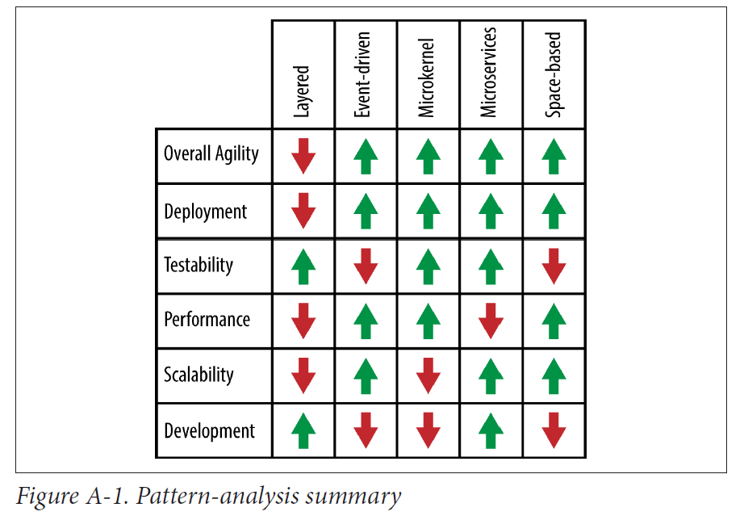

# Software Architecture Design Notes

## Table of Contents (ToC)
- [Overview](#overview)
- [Key Principles](#key-principles)
- [Common Architectural Patterns](#common-architectural-patterns)
- [Tools & Frameworks](#tools--frameworks)
- [Best Practices](#best-practices)
- [Hello World!](#hello-world)
- [References](#references)

## Overview

Effective software architecture design is crucial for building scalable, maintainable, and reliable systems.

## Key Principles

- **Modularity:** Divide the system into independent and interchangeable modules.
- **Scalability:** Design to handle growth in data, users, or traffic.
- **Flexibility:** Create systems that can adapt to evolving requirements.
- **Maintainability:** Ensure ease of maintenance through clear structures and documentation.

## Common Architectural Patterns

- **Microservices:** Divide the application into small, independent services.
- **MVC (Model-View-Controller):** Separate the application into three interconnected components.
- **Layered Architecture:** Organize components into horizontal layers.

### Pattern Analysis Summary



Source: [Software Architecture Patterns by Mark Richards](https://www.oreilly.com/library/view/software-architecture-patterns/9781491971437/)

## Tools & Frameworks

- **Enterprise Architect:** Visual modeling tool for UML diagrams.
- **Docker:** Containerization tool for packaging applications.
- **Spring Framework:** Java-based framework for building enterprise applications.

## Best Practices

- **Define Clear Interfaces:** Clearly define the interaction points between components.
- **Use Design Patterns:** Apply proven design patterns for common problems.
- **Performance Considerations:** Address performance concerns from the beginning.

## Hello World!
```python
# Simple Python example illustrating modularity
class Module:
    def greet(self):
        return "Hello, World!"

module_instance = Module()
print(module_instance.greet())
```

## References

- Fowler, M. (2003). "Patterns of Enterprise Application Architecture." Addison-Wesley.
- Gamma, E., Helm, R., Johnson, R., & Vlissides, J. (1994). "Design Patterns: Elements of Reusable Object-Oriented Software." Addison-Wesley.
- Bass, L., Clements, P., & Kazman, R. (2012). "Software Architecture in Practice." Addison-Wesley.

Wikipedia:

secure coding: https://en.m.wikipedia.org/wiki/Secure_coding

https://techbeacon.com/security/4-ways-secure-your-code-regardless-programming-language

https://wiki.sei.cmu.edu/confluence/plugins/servlet/mobile?contentId=88042842#content/view/88042842

Coding standards:
https://www.perforce.com/blog/qac/secure-coding-standards

Concurrent programming :
https://en.m.wikipedia.org/wiki/Concurrent_computing

https://en.wikipedia.org/wiki/List_of_concurrent_and_parallel_programming_languages

Programming paradigms:
https://en.m.wikipedia.org/wiki/Programming_paradigm

Bugs:
https://en.m.wikipedia.org/wiki/Software_bug

Automatic bug fixing:

https://en.m.wikipedia.org/wiki/Automatic_bug_fixing

Design Patters

- https://en.m.wikipedia.org/wiki/Software_design_pattern
- https://www.geeksforgeeks.org/software-design-patterns/

